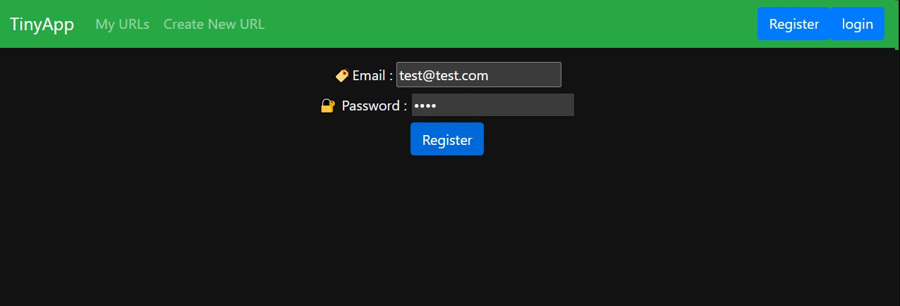

# Lighthouse Labs W3 Project
## Tiny App
- Users can save their own short-cut url
- Users can update their url lists
- Non-registered users cannot see any pages without register / login

## Final Product
Block to Unknown Client

Register

After Login

Created Urls

## Dependencies
- Node.js
- Express
- EJS
- bcrypt
- body-parser
- cookie-session
- method-odvrride

## Getting Started
- Install all dependencies (using the 'npm install' command)
- Run the development web server using the 'node express_server.js' command

#### Register
- must submit email and password
- if any or both are empty, redirect invalid page
- if submitted email is already exist in data, redirect invalid page
- once successfully submitted, redirect to /urls page

#### Login
- if email or password is not correct, invalid page
- if submitted email is not in data, invalid page
- once successfully login, redirect to /urls page

### Invalid
- client see this page if submitted information is invalid
- client can go to register or login page by clicking the button

#### My URLs
- shows the lists of added urls
- user can edit or delete

#### Create New URL
- user can create new url
- once create new url, redirect edit page